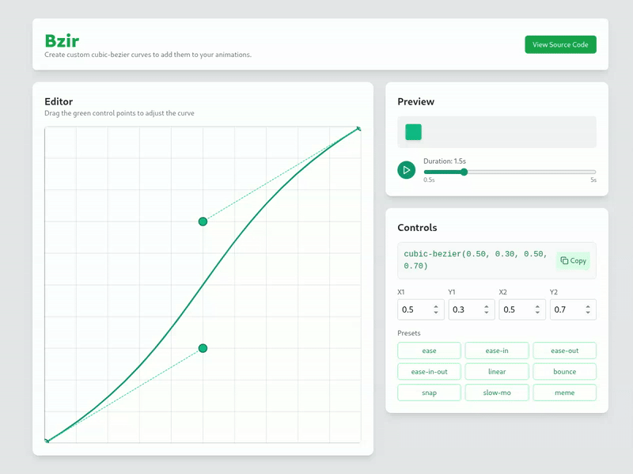

# Bzir
Website to easily create cubic-bezier easing curves for animations



### Build from source
1. Build the docker container
```
docker build -t lnardon/bzir .
```
2. Run the container and access it on http://localhost:9898
```
docker run -d -p 9898:80 lnardon/bzir
```

#### What was used
- React.js
- Typescript
- Vite
- Tailwindcss
- Lucide React Icons
- Animated Text Lettes (npm)